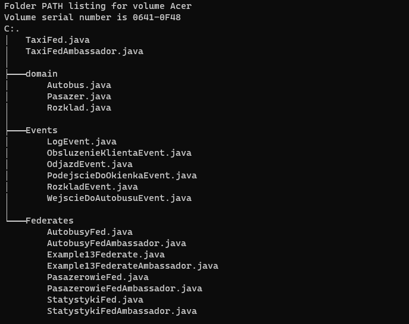
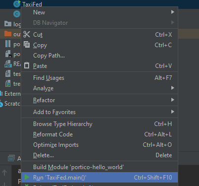
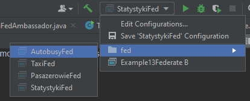
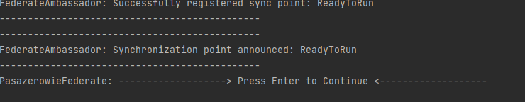
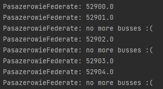

## Projekt zaliczeniowy MeSK

### Grupa:

- Piotr Targowski

- Filip Szpręgiel

### Temat:

- Przystanek autobusowy 

Dworzec PKS. Przybywający losowo klienci trafiają do kolejek. Godzina odjazdu i
wybór PKS-u przez pasażera jest losowy. Jest jedna kolejka biletowa PKS. Odjazdy
PKS-u wg zadanego rozkładu. Oszacować liczbę pasażerów którzy nie zdążyli na
PKS i zmienili środek transportu na taxi oraz długość czasu jaki potrzebowali na
zmianę środka transportu.

### Struktura projektu:




### Jak pobrac?

```aidl
git clone
```


### Jak rozpoczac prace projektu

konieczne jest odpalenie wszystkich federatow w jednym momencie:

- Autobusyfed
- Pasazerowiefed
- Statystykifed
- Taxifed


Możliwe jest to na 2 sposoby

### sposob 1:

Odpalenie z wiersza polecen 'cmd' lub 'powershell' w 4 osobnych oknach


### sposob 2:

InteliJ (ide od firmy JetBrains) umozliwia opcje odpalenia w prostszy sposob, w tym celu

1. kliknij prawym przyciskiem myszki na federata
2. kliknij w przycisk run:
   


   

3. Możliwe jest tez użycie przygotowane przez nas obiektu w ide (ktore znajduje się w):




### do obu sposobow:

Nastpenie w zaleznosci od odpalonego federata przywita nas bardzo podobne okno:



W tym momencie konieczne będzie kliknac enter (czasem z niewiadomych mi przyczyn trzeba zrobic to 2 razy) w celu wystartowania federatow :

### przyklad jednego wystartowanego federata:



### POMOC:

w razie jakichkolwiek problemow proszę o informację do autora repozytorium, postaramy się pomoc jak to tylko możliwe :)


